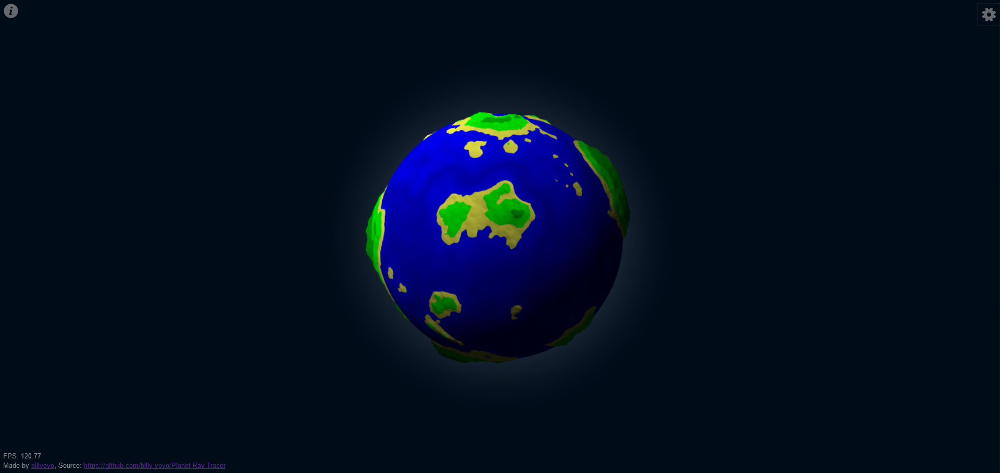

# Planet Ray Tracer

This is a ray tracer rendering a height-mapped sphere using an implicit surface technique (as opposed to an explicit surface, i.e. creating a mesh). It is dependancy-less, though not really for any good reason.

You can play around with it here: https://billy-yoyo.github.io/Planet-Ray-Tracer/

I've only tested it with chrome and firefox. It should techinically work with anything with decent WebGL support, however in reality it'll only work on a device with a reasonable good GPU. If your device is struggling to keep a stable framerate, turn down "antialiasing" to 1x, "ray accuracy" to maybe 2, and ray stride up to maybe 0.008. You can also use a lower resolution heightmap by turning down resolution under planet generation and then clicking "generate".

I'd also like to put a disclaimer on this whole project, I'm fairly new to WebGL, or even OpenGL, so I'm sure there are various things I could have done in a nicer / more efficient way. If you do notice anything like that, I'd appreciate it if you pointed it out to me somehow since this definitely won't be the last WebGL project I work on and I'd like to improve :). One specific think I'm really not sure of is how to use vertex shaders more effectively - I essentially ignored them for this project and put absolutely everything in to fragment shaders.

## Render Structure

The first render pass looks something like this:

1. Render perlin noise to heightmap with RGB values set to 0, A values set to height
2. Flip our heightmap pingpong textures, using our perlin noise heightmap as input and the currently empty one as our output. This flip will fill in the FGB values and change any heights lower than the waterlevel to the waterlevel.
3. Calculate the depth map, the RGB values are set to the XYZ coordinates of the intersection, or the XYZ values of the ray direction for no intersection. The A value is used as a flag for the type of intersection (negative is no intersection, 2.0 is shadowed intersection, anything else is normal intersection).
4. Render to the canvas, use the depth map and heightmaps to calculate surface normals and colours, then use these to determine pixel colour.

From that point onwards (4) is the only shader pass which will be run every frame. (1) will only ever be re-run if we're regenerating the planet, (2) will be rerun if any of the heights are supposed to be changing (water level changed, drawing with mouse, etc.). (3) will be run if the heightmap changes, or if any of the view and render settings change (e.g. the sphere is rotated).

The X/Y values in the heightmap correlate to the longitude/lattitude of the sphere respectively.

## WebGL Annoyances

In general I love using WebGL, even if it can be a little bit cumbersome. However, WebGL 1.0 does have some limitations, most notably for this project is the lack of support for multiple framebuffer attachments. This means you are essentially limited to each shader only having 4 floats per pixel as output. On one hand this encourages you to split your program up in to more granular shaders and stack them on top of eachother, however on the other hand it can lead to inefficiencies where you're essentially calculating the same thing twice in two shaders because you didn't have the space to pass from one shader to another.

Later versions of WebGL also have a larger library of built-in functions, some of which can be useful, though none of which are really necessary (you can always just reimplement them yourself).

## Planet Intersection Algorithm

For each pixel, rays will be fired (potentially multiple per pixel, depending on if supersampling is enabled). The ray is fired from our 'eye' towards the position of the pixel in world coordinates (we place our screen in the world as a 2d plane). The first collision between the ray and an object in the scene is then used to calculate the colour of that ray.

To find a collision between a given ray and our planet, we first find the intersections between the ray and our maximum radius sphere. If the ray doesn't collide with the maximum radius sphere it's impossible for it to collide with the planet. If we do have a collision, then we find the closest and furthest possible points along the ray where an intersection could happen. If the ray intersects with the minimum radius sphere, the furthest possible point will be this intersection since at that point the ray *must* intersect, otherwise the furthest point is where the ray exits the maximum radius sphere.

Now we ray march from the closest possible point to the furthest point. If we find a point along our march where the ray is inside the planet (the 'height' of the ray is lower than the height of the sphere at that point), then we perform several iterations of a binary search between the previous point (which was above the planet) and the current point (which is inside the planet). This should give us an accurate approximation for where the ray intersects the planet. In rough GLSL:

    vec3 getIntersection(vec3 closest, vec3 furthest, float strideLength, int binarySearchIterations) {
        float marchLength = distance(closest, furthest);
        vec3 stride = (furthest - closest) * (strideLength / marchLength);
        vec3 pos = closest;
        float progress = 0.0;

        while (progress < marchLength) {
            float rayHeight = getRayHeight(pos);
            float planetHeight = getPlanetHeight(pos);

            if (rayHeight < planetHeight) {
                vec3 lower = pos - stride;
                vec3 upper = pos;
                vec3 middle = (lower + upper) / 2.0;

                for (int i = 0; i < binarySearchIterations; i++) {
                    float rayHeight = getRayHeight(middle);
                    float planetHeight = getPlanetHeight(middle);

                    if (rayHeight < planetHeight) {
                        upper = middle;
                    } else {
                        lower = middle;
                    }
                    middle = (lower + upper) / 2.0;
                }

                return middle;
            }

            pos += stride;
            progress += strideLength;
        }

        return null;
    }

If an intersection was found, we then want to calculate the normal of the planet at this point. To calculate the normal, we calculate the vectors pointing from the intersection point to each point in a 3x3 grid around it. For each of these vectors, we then calculate a vector which is both orthogonal to the vector and coplanar to the plane defined by the sphere normal at the point and the vector. We then use the average of all these orthogonal vectors as our surface normal. In rough GLSL code:

    vec3 getNormal(vec3 sphereOrigin, vec3 intersection) {
        vec3 normalAverage = vec3(0.0);
        float samples = 0.0;

        for (int x = -1; x <= 1; x++) {
            for (int y = -1; y <= 1; y++) {
                if (x == 0 && y == 0) {
                    continue;
                }

                // some function which can calculate the position of the vectors in the 3x3 grid
                vec3 vector = getGridVector(intersection, x, y);
                vec3 direction = vector - intersection;

                vec3 sphereNormal = normalize(vector - sphereOrigin);

                // calculates vector which is orthogonal to direction, and coplanar to the plane defined by (direction, sphereNormal)
                // if direction == sphereNormal, then this should just return sphereNormal
                // also, since there will be two such vectors, we take one which is in the same 'direction' as sphereNormal (positive dot product).
                vec3 normal = getOrthogonalCoplanar(direction, sphereNormal);

                normalAverage += normal;
                samples += 1.0;
            }
        }

        return normalAverage / samples;
    }

We can then use this normal to calculate the lighting at the intersection point. We find the colour of the planet at the intersection point using our heightmap. We can also optionally do a shadow check by firing another ray towards our light and flagging the intersection as 'shadowed' if this ray intersects anything.

And that's it, the rendering of the planet is actually very simple and produces nice, smooth results for the render with fairly low artefacting (compared to attempting to generate a polygon mesh for the heightmap). It is also fairly performant, whilst I haven't done any performance checks I'd imagine it's at least comparable to finding the intersection between a ray and a mesh.

## Some Inefficiencies

I'm sure there are quite a few, but the following are two glaring ones that I haven't fixed:

1. There's no need to keep recalculating the surface normals when the depth map isn't changing. A more efficient approach would be to have another render pass in between the depth map and the canvas render which calculated the surface normals, and only update this when the depth map changes.

2. Having to rotate the sample point every time we sample the heightmap is horrendously inefficient. To fix this we would create a third heightmap, which is the rotated heightmap, and every time the heightmap is flipped we'd have a render pass which would take the latest heightmap and use the rotation matrix to map the rotated heightmap. This would require a bit of refactoring all around the GLSL code though, and I thought of it too late, so I'll make do with the rotation matrix for now. Note that I think the current method is actually more efficient if the sphere is pretty much always rotating, but it is obviously far less efficient if the sphere is stationary.